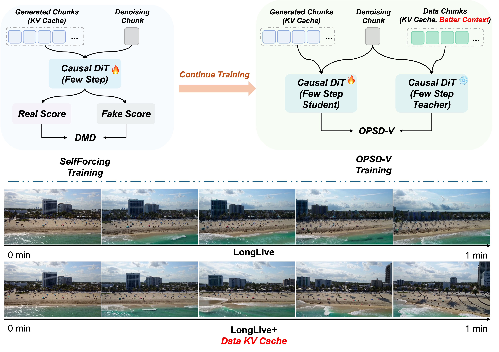
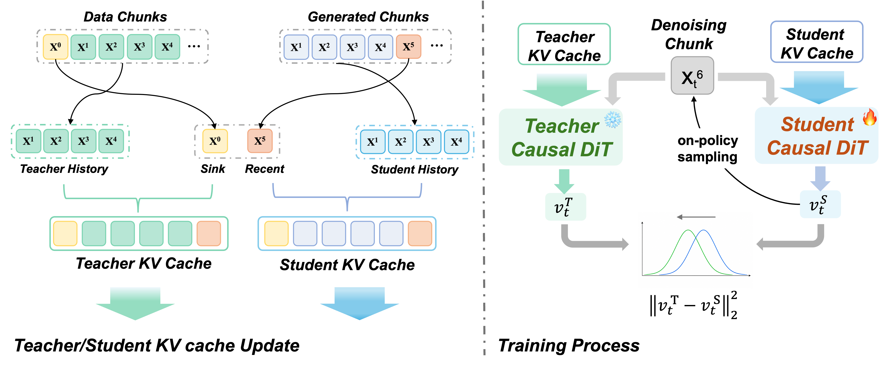

# OPSD-V

<p align="center">
  <b>On-Policy Self-Distillation for Post-Training Few-Step Autoregressive Video Generators</b>
</p>

<p align="center">
  <a href="#installation">Installation</a> |
  <a href="#checkpoints">Checkpoints</a> |
  <a href="#training">Training</a> |
  <a href="#inference">Inference</a> |
  <a href="#citation">Citation</a>
</p>

<p align="center">
  
  
  
  
</p>

OPSD-V is a cache-aware on-policy self-distillation framework for continued post-training of few-step autoregressive video diffusion generators. It keeps the student on the exact rollout states it will visit at deployment, while a cleaner data-assisted teacher provides dense velocity supervision over the same denoising trajectory and temporal positions.

This release contains the training and inference code for OPSD-V. Checkpoints and datasets are not bundled.

<p align="center">
  
</p>

## Highlights

- **On-policy student rollout.** The student writes its own generated chunks into the KV cache and keeps rolling out from the resulting temporal states.
- **Cleaner teacher context.** The teacher is evaluated on the same student-visited noisy latents and timesteps, but uses real-video history for older cache context.
- **Few-step path preserved.** OPSD-V does not change the original 4-step autoregressive sampler used at inference.
- **Memory-conscious training.** Chunk-wise backward, detached denoising transitions, FSDP, gradient checkpointing, and LoRA/EMA support keep long rollouts feasible.
- **Deterministic prompt seeding.** `--per_prompt_seed` avoids noise drift when resuming a partially generated evaluation folder.

## Method

At each chunk, the student follows the deployed AR video generation path: sample with the fixed few-step scheduler, update the student KV cache with the generated chunk, and continue. The teacher is queried at the same temporal position and denoising step, but its cache replaces older history with corresponding real-video context while preserving the most recent generated chunk for autoregressive continuation. The training objective matches the student and teacher velocity predictions on these student-induced states.

<p align="center">
  
</p>

## Repository Layout

```text
configs/                 Training and inference YAML files
model/                   OPSD rollout, teacher cache, and loss logic
pipeline/                AR inference and OPSD streaming training pipelines
trainer/                 FSDP/LoRA trainer, EMA, resume, and checkpointing
utils/                   Dataset, scheduler, LoRA, memory, and Wan wrappers
wan/modules/             Wan2.1 modules and causal attention implementation
tools/                   Utilities, including LoRA merge
example/                 Prompt files for quick inference checks
train.py                 Distributed OPSD-V training entry point
inference.py             Text/LMDB inference entry point
```

The release intentionally removes internal cluster paths, generated videos, logs, checkpoints, datasets, and unrelated legacy trainers.

## Installation

We recommend Python 3.10, CUDA-capable GPUs, and PyTorch 2.5 or newer.

```bash
git clone <repository-url> opsd-v
cd opsd-v

python -m venv .venv
source .venv/bin/activate
pip install -U pip
pip install -r requirements.txt
```

FlashAttention 2 or 3 is optional but strongly recommended for speed and memory efficiency. Install the wheel that matches your PyTorch and CUDA environment.

If you enable debug visualizations in `utils/debug_option.py`, install OpenCV as well:

```bash
pip install opencv-python
```

## Checkpoints

Place the official Wan2.1-T2V-1.3B files under:

```text
checkpoints/Wan2.1-T2V-1.3B/
├── config.json
├── diffusion_pytorch_model*.safetensors or equivalent transformer weights
├── Wan2.1_VAE.pth
├── models_t5_umt5-xxl-enc-bf16.pth
└── google/umt5-xxl/
```

You can override this location either in YAML:

```yaml
model_kwargs:
  model_root: /path/to/Wan2.1-T2V-1.3B
```

or through an environment variable:

```bash
export WAN_MODEL_ROOT=/path/to/Wan2.1-T2V-1.3B
```

The provided configs expect the following project checkpoints:

| File | Used by | Meaning |
| --- | --- | --- |
| `checkpoints/longlive_base.pt` | LongLive training/inference | Base few-step AR generator |
| `checkpoints/longlive_lora.pt` | LongLive training | Initial LongLive LoRA, if continuing from a released adapter |
| `checkpoints/self_forcing_dmd_ema_as_generator.pt` | Self-Forcing training/inference | Self-Forcing DMD/EMA generator |
| `checkpoints/opsdv_longlive_lora.pt` | LongLive inference | OPSD-V LoRA checkpoint |
| `checkpoints/opsdv_self_forcing_lora.pt` | Self-Forcing inference | OPSD-V LoRA checkpoint |

Base generator checkpoints may store weights under `generator`, `generator_ema`, or `model`. OPSD-V LoRA checkpoints store `generator_lora`, optional `generator_ema`, optimizer state, and `step`.

## Training Data

Training uses an LMDB containing precomputed text embeddings and Wan VAE latents. The loader accepts both naming schemes below:

```text
prompts_shape / text_shape
prompt_embeds_shape
latents_shape / video_shape

prompts_{i}_data / text_{i}_data       UTF-8 prompt string
prompt_embeds_{i}_data                 float16 text embedding bytes
latents_{i}_data / video_{i}_data      float16 latent bytes
```

For the released 480 x 832 setting, latent samples have shape:

```text
[T, 16, 60, 104]
```

The default configs train on up to 243 latent frames, use a real-video first chunk, roll out seven chunks before applying loss (`opsd_loss_start_frame: 21`), and supervise the later student-visited rollout states.

## Training

### LongLive continued post-training

```bash
torchrun --standalone --nproc_per_node=8 train.py \
  --config_path configs/train_longlive_lora.yaml \
  --logdir logs/opsdv_longlive
```

### Self-Forcing continued post-training

```bash
torchrun --standalone --nproc_per_node=8 train.py \
  --config_path configs/train_self_forcing_lora.yaml \
  --logdir logs/opsdv_self_forcing
```

Training resumes automatically from the latest `checkpoint_model_*/model.pt` in `--logdir`. Use `--no-auto-resume` for a fresh run or `--no_save` for a quick debugging run.

### Key OPSD-V options

| Option | Default | Purpose |
| --- | --- | --- |
| `opsd_student_context_mode` | `generated_kv` | Keep the student fully on-policy. |
| `opsd_teacher_context_mode` | `gt_kv` | Use real-video history for a cleaner teacher cache. |
| `opsd_teacher_trajectory_mode` | `student` | Evaluate teacher and student on student-visited noisy states. |
| `opsd_loss_type` | `flow` | Match velocity/flow predictions rather than reconstructed `x0`. |
| `opsd_loss_step_mode` | `all` | Supervise all denoising steps in the fixed few-step trajectory. |
| `opsd_loss_start_frame` | `21` | Skip the first seven 3-frame chunks before applying loss. |
| `opsd_backward_per_chunk` | `true` | Backpropagate chunk by chunk to reduce activation memory. |
| `opsd_use_relative_sink` | `true` | Match the relative-sink cache policy used at inference. |

## Inference

Generate from a text file with one prompt per line:

```bash
CUDA_VISIBLE_DEVICES=0 python inference.py \
  --config_path configs/inference_longlive.yaml \
  --data_path example/long_example.txt \
  --output_folder outputs/longlive \
  --num_output_frames 243 \
  --seed_list 1,2 \
  --use_lmdb_pipeline \
  --lmdb_cache_update_source generated \
  --lmdb_use_relative_sink \
  --per_prompt_seed
```

Use `configs/inference_self_forcing.yaml` for the Self-Forcing backbone:

```bash
CUDA_VISIBLE_DEVICES=0 python inference.py \
  --config_path configs/inference_self_forcing.yaml \
  --data_path example/MovieGenVideoBench_extended.txt \
  --output_folder outputs/self_forcing \
  --num_output_frames 243 \
  --seed_list 1,2 \
  --use_lmdb_pipeline \
  --lmdb_cache_update_source generated \
  --lmdb_use_relative_sink \
  --per_prompt_seed
```

`--per_prompt_seed` derives an independent deterministic noise seed from `(seed, prompt_index)`. This is useful for benchmarking because resuming a partially completed output folder will not shift the noise assigned to later prompts.

For LMDB inference with precomputed embeddings and optional real-video latents, add `--use_lmdb`:

```bash
CUDA_VISIBLE_DEVICES=0 python inference.py \
  --config_path configs/inference_longlive.yaml \
  --data_path data/eval.lmdb \
  --output_folder outputs/eval \
  --num_output_frames 243 \
  --use_lmdb \
  --lmdb_cache_update_source generated \
  --lmdb_use_relative_sink \
  --per_prompt_seed
```

Arguments that expose GT cache replacement or future GT context are diagnostic tools, not the standard open-ended generation setting.

## Merge a LoRA

Merge an OPSD-V LoRA into a plain generator checkpoint:

```bash
python tools/merge_lora_to_generator.py \
  --config_path configs/inference_longlive.yaml \
  --generator_ckpt checkpoints/longlive_base.pt \
  --lora_ckpt checkpoints/opsdv_longlive_lora.pt \
  --output_path checkpoints/opsdv_longlive_merged.pt
```

Add `--use_lora_ema` to merge the teacher/EMA branch when it is present.

## Practical Notes

- `--use_lmdb_pipeline` selects the cache-aware inference pipeline even for plain text prompts.
- `--use_lmdb` means the input itself is an LMDB dataset.
- `--lmdb_cache_update_source generated` is the standard deployment mode.
- `--lmdb_use_relative_sink` should be enabled when comparing with the training configs above.
- Generated videos are saved at 16 FPS.
- Checkpoints, datasets, logs, and outputs are ignored by `.gitignore`.

## Troubleshooting

| Symptom | Likely fix |
| --- | --- |
| `CUDA error: invalid device ordinal` | Make sure `--nproc_per_node` does not exceed visible GPUs. |
| Wan model files are not found | Set `model_kwargs.model_root` or `WAN_MODEL_ROOT`. |
| LoRA checkpoint loads but output looks unchanged | Confirm `adapter` exists in the YAML and `lora_ckpt` points to an OPSD-V LoRA checkpoint. |
| Evaluation is not reproducible after resuming | Add `--per_prompt_seed`. |
| Debug visualization imports `cv2` | Install `opencv-python` or keep `DEBUG=False`. |

## Citation

```bibtex
@misc{liu2026opsdv,
  title  = {OPSD-V: On-Policy Self-Distillation for Post-Training Few-Step Autoregressive Video Generators},
  author = {Liu, Hongyu and Wang, Chun and Gao, Feng and He, Xuanhua and Ma, Yue and Wan, Ziyu and Zhang, Yong and Wei, Xiaoming and Chen, Qifeng},
  year   = {2026},
  note   = {Preprint}
}
```

## Acknowledgements

This codebase builds on Wan2.1, Self-Forcing, and LongLive. We thank their authors for releasing models and code. Please follow the licenses and usage terms of the corresponding base checkpoints and upstream components.

## License

This repository is released under the Apache License 2.0. See [LICENSE](LICENSE). Individual upstream components retain their original copyright notices.
