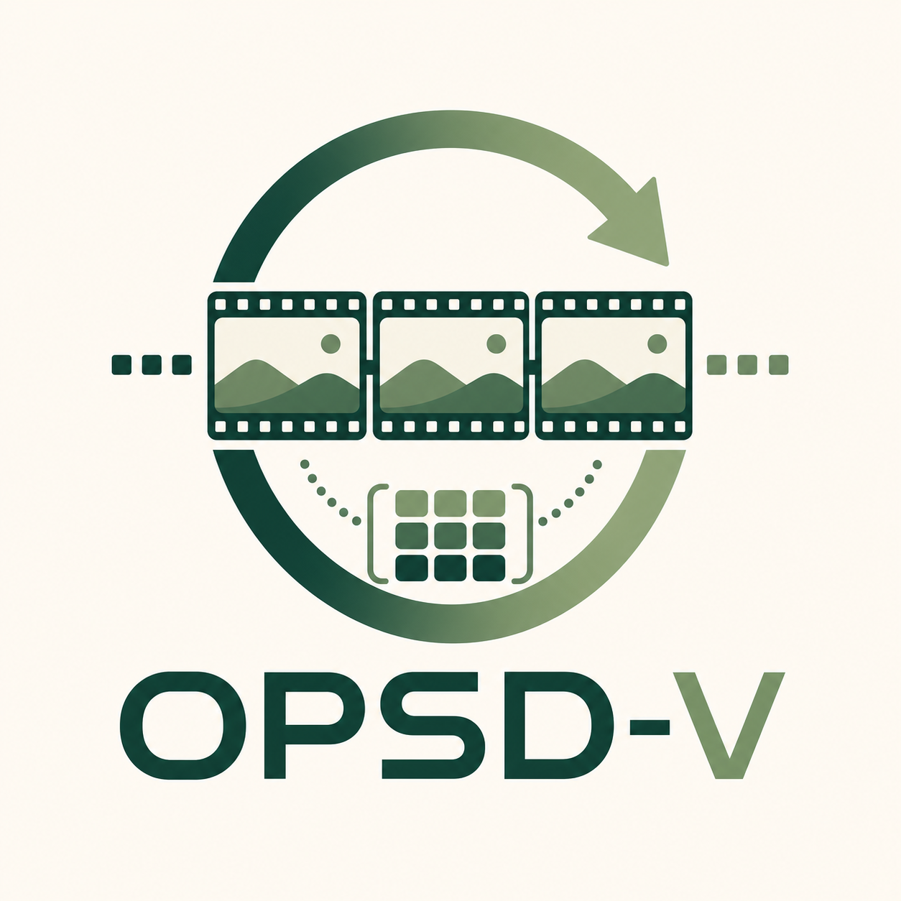

# OPSD-V

<p align="center">
  
</p>

<p align="center">
  <b>On-Policy Self-Distillation for Post-Training Few-Step Autoregressive Video Generators</b>
</p>

<p align="center">
  <a href="https://kumapowerliu.github.io/">Hongyu Liu</a><sup>1,2</sup> ·
  <a href="https://chunwang.site/">Chun Wang</a><sup>1,2</sup> ·
  <a href="https://scholar.google.com/citations?user=lFkCeoYAAAAJ&hl=en">Feng Gao</a><sup>1,*</sup> ·
  <a href="https://xuanhuahe.github.io/">Xuanhua He</a><sup>1,2</sup> ·
  <a href="https://mayuelala.github.io/">Yue Ma</a><sup>2</sup> ·
  <a href="http://raywzy.com/">Ziyu Wan</a><sup>3</sup> ·
  <a href="https://auto202603.github.io/">Yong Zhang</a><sup>1,†</sup> ·
  <a href="https://scholar.google.com/citations?user=JXV5yrZxj5MC&hl=zh-CN">Xiaoming Wei</a><sup>1</sup> ·
  <a href="https://cqf.io/">Qifeng Chen</a><sup>2,*</sup>
</p>

<p align="center">
  <sup>1</sup>Meituan &nbsp;&nbsp;
  <sup>2</sup>HKUST &nbsp;&nbsp;
  <sup>3</sup>City University of Hong Kong
  <br>
  <sup>*</sup>Corresponding authors &nbsp;&nbsp;
  <sup>†</sup>Project lead
</p>

<p align="center">
  <a href="#installation">Installation</a> |
  <a href="#checkpoints">Checkpoints</a> |
  <a href="#training">Training</a> |
  <a href="#inference">Inference</a> |
  <a href="#citation">Citation</a>
</p>

<p align="center">
  <a href="https://kumapowerliu.github.io/OPSD-V/assets/opsdv.pdf">
    
  </a>
  <a href="https://kumapowerliu.github.io/OPSD-V/">
    
  </a>
  <a href="LICENSE">
    
  </a>
</p>

OPSD-V is a cache-aware on-policy self-distillation framework for continued post-training of few-step autoregressive video diffusion generators. It keeps the student on the exact rollout states it will visit at deployment, while a cleaner data-assisted teacher provides dense velocity supervision over the same denoising trajectory and temporal positions.

This release contains the training and inference code for OPSD-V. Checkpoints and datasets are not bundled.

<p align="center">
  
</p>

## Highlights

- **On-policy student rollout.** The student writes its own generated chunks into the KV cache and keeps rolling out from the resulting temporal states.
- **Cleaner teacher context.** The teacher is evaluated on the same student-visited noisy latents and timesteps, but uses real-video history for older cache context.
- **Few-step path preserved.** OPSD-V does not change the original 4-step autoregressive sampler used at inference.
- **Memory-conscious training.** Chunk-wise backward, detached denoising transitions, FSDP, gradient checkpointing, and LoRA/EMA support keep long rollouts feasible.
- **Deterministic prompt seeding.** `--per_prompt_seed` avoids noise drift when resuming a partially generated evaluation folder.

## Method

At each chunk, the student follows the deployed AR video generation path: sample with the fixed few-step scheduler, update the student KV cache with the generated chunk, and continue. The teacher is queried at the same temporal position and denoising step, but its cache replaces older history with corresponding real-video context while preserving the most recent generated chunk for autoregressive continuation. The training objective matches the student and teacher velocity predictions on these student-induced states.

<p align="center">
  
</p>

## Repository Layout

```text
configs/                 Training and inference YAML files
model/                   OPSD rollout, teacher cache, and loss logic
pipeline/                AR inference and OPSD streaming training pipelines
trainer/                 FSDP/LoRA trainer, EMA, resume, and checkpointing
utils/                   Dataset, scheduler, LoRA, memory, and Wan wrappers
wan/modules/             Wan2.1 modules and causal attention implementation
tools/                   Utility scripts
example/                 Prompt files for quick inference checks
train.py                 Distributed OPSD-V training entry point
inference.py             Text/LMDB inference entry point
```

This release excludes generated videos, logs, checkpoints, datasets, and unrelated legacy trainers.

## Installation

We recommend Python 3.10 with CUDA-capable GPUs. OPSD-V uses
`torch.nn.attention.flex_attention` in the causal Wan blocks, so PyTorch 2.5+
is the safest baseline. Install PyTorch for your CUDA runtime first, then
install the remaining packages from [`requirements.txt`](requirements.txt).

```bash
git clone <repository-url> opsd-v
cd opsd-v

conda create -n opsdv python=3.10 -y
conda activate opsdv
pip install -U pip
```

For example, on CUDA 12.1:

```bash
pip install torch==2.5.1 torchvision==0.20.1 \
  --index-url https://download.pytorch.org/whl/cu121

pip install -r requirements.txt
```

FlashAttention 2 or 3 is optional but strongly recommended for speed and
memory efficiency. Install the wheel that matches your PyTorch, CUDA, and GPU
architecture. For Ampere/Ada GPUs, FlashAttention 2 is usually enough; for
Hopper GPUs, FlashAttention 3 can be used when available. If FlashAttention is
not installed, the code falls back to PyTorch scaled-dot-product attention, but
long-video training/inference will be slower and may use more memory.

If you enable attention-mask debug visualizations in `utils/debug_option.py`,
install OpenCV as well:

```bash
pip install opencv-python
```

## Checkpoints

Download the official Wan2.1-T2V-1.3B backbone from Hugging Face and place it
under `checkpoints/Wan2.1-T2V-1.3B/`:

```bash
mkdir -p checkpoints
hf download Wan-AI/Wan2.1-T2V-1.3B \
  --local-dir checkpoints/Wan2.1-T2V-1.3B
```

The directory should contain the Wan transformer, VAE, T5 encoder, tokenizer,
and model config files, e.g.:

```text
checkpoints/Wan2.1-T2V-1.3B/
├── config.json
├── diffusion_pytorch_model*.safetensors or equivalent transformer weights
├── Wan2.1_VAE.pth
├── models_t5_umt5-xxl-enc-bf16.pth
└── google/umt5-xxl/
```

You can override this location either in YAML:

```yaml
model_kwargs:
  model_root: /path/to/Wan2.1-T2V-1.3B
```

or through an environment variable:

```bash
export WAN_MODEL_ROOT=/path/to/Wan2.1-T2V-1.3B
```

Download the OPSD-V released checkpoints into `checkpoints/`:

```bash
hf download MeiGen-AI/OPSD-V \
  checkpoints/longlive_base.pt \
  checkpoints/longlive_lora.pt \
  checkpoints/opsdv_longlive_lora.pt \
  checkpoints/self_forcing_dmd_ema_as_generator.pt \
  checkpoints/opsdv_self_forcing_lora.pt \
  --local-dir .
```

If your environment has not authenticated with Hugging Face yet, run
`hf auth login` first.

After downloading, the provided configs expect:

| File | Used by | Meaning |
| --- | --- | --- |
| `checkpoints/longlive_base.pt` | LongLive training/inference | Base few-step AR generator |
| `checkpoints/longlive_lora.pt` | LongLive training | Initial LongLive LoRA, if continuing from a released adapter |
| `checkpoints/self_forcing_dmd_ema_as_generator.pt` | Self-Forcing training/inference | Self-Forcing DMD/EMA generator |
| `checkpoints/opsdv_longlive_lora.pt` | LongLive inference | OPSD-V LoRA checkpoint |
| `checkpoints/opsdv_self_forcing_lora.pt` | Self-Forcing inference | OPSD-V LoRA checkpoint |

Base generator checkpoints may store weights under `generator`, `generator_ema`, or `model`. OPSD-V LoRA checkpoints store `generator_lora`, optional `generator_ema`, optimizer state, and `step`.

## Training Data

The full training dataset cannot be redistributed due to data licensing and privacy constraints.
Instead, we provide a small 10-video toy example for checking the LMDB format,
testing the data loader, and running smoke tests. The toy data is intended for
code validation only and is not sufficient to reproduce the paper numbers.

Training uses an LMDB containing precomputed text embeddings and Wan VAE latents.
See [`data_processing/`](data_processing/) for an audio-free preprocessing
pipeline that converts your own long videos into this LMDB format. The private
training data cannot be released, and the repository intentionally does not
include any video, latent, embedding, or LMDB data files.
The loader accepts both naming schemes below:

```text
prompts_shape / text_shape
prompt_embeds_shape
latents_shape / video_shape

prompts_{i}_data / text_{i}_data       UTF-8 prompt string
prompt_embeds_{i}_data                 float16 text embedding bytes
latents_{i}_data / video_{i}_data      float16 latent bytes
```

For the released 480 x 832 setting, latent samples have shape:

```text
[T, 16, 60, 104]
```

The default configs train on up to 243 latent frames, use a real-video first chunk, roll out seven chunks before applying loss (`opsd_loss_start_frame: 21`), and supervise the later student-visited rollout states.

## Training

The paper experiments use 24 GPUs across 3 nodes, with 8 GPUs per node. On each node, set `MASTER_ADDR` to the address of rank-0 node and set `NODE_RANK` to `0`, `1`, or `2` respectively.

### LongLive continued post-training

```bash
export MASTER_ADDR=<rank-0-host>
export MASTER_PORT=29500
export NODE_RANK=<0|1|2>

torchrun --nnodes=3 --nproc_per_node=8 \
  --node_rank=${NODE_RANK} \
  --master_addr=${MASTER_ADDR} \
  --master_port=${MASTER_PORT} \
  train.py \
  --config_path configs/train_longlive_lora.yaml \
  --logdir logs/opsdv_longlive
```

### Self-Forcing continued post-training

```bash
export MASTER_ADDR=<rank-0-host>
export MASTER_PORT=29500
export NODE_RANK=<0|1|2>

torchrun --nnodes=3 --nproc_per_node=8 \
  --node_rank=${NODE_RANK} \
  --master_addr=${MASTER_ADDR} \
  --master_port=${MASTER_PORT} \
  train.py \
  --config_path configs/train_self_forcing_lora.yaml \
  --logdir logs/opsdv_self_forcing
```

Training resumes automatically from the latest `checkpoint_model_*/model.pt` in `--logdir`. Use `--no-auto-resume` for a fresh run or `--no_save` for a quick debugging run.

### Key OPSD-V options

| Option | Default | Purpose |
| --- | --- | --- |
| `opsd_student_context_mode` | `generated_kv` | Keep the student fully on-policy. |
| `opsd_teacher_context_mode` | `gt_kv` | Use real-video history for a cleaner teacher cache. |
| `opsd_teacher_trajectory_mode` | `student` | Evaluate teacher and student on student-visited noisy states. |
| `opsd_loss_type` | `flow` | Match velocity/flow predictions rather than reconstructed `x0`. |
| `opsd_loss_step_mode` | `all` | Supervise all denoising steps in the fixed few-step trajectory. |
| `opsd_loss_start_frame` | `21` | Skip the first seven 3-frame chunks before applying loss. |
| `opsd_backward_per_chunk` | `true` | Backpropagate chunk by chunk to reduce activation memory. |
| `opsd_use_relative_sink` | `true` | Match the relative-sink cache policy used at inference. |

## Inference

Generate from a text file with one prompt per line:

```bash
CUDA_VISIBLE_DEVICES=0 python inference.py \
  --config_path configs/inference_longlive.yaml \
  --data_path example/long_example.txt \
  --output_folder outputs/longlive \
  --num_output_frames 243 \
  --seed_list 1,2 \
  --use_lmdb_pipeline \
  --lmdb_cache_update_source generated \
  --lmdb_use_relative_sink \
  --per_prompt_seed
```

Use `configs/inference_self_forcing.yaml` for the Self-Forcing backbone:

```bash
CUDA_VISIBLE_DEVICES=0 python inference.py \
  --config_path configs/inference_self_forcing.yaml \
  --data_path example/MovieGenVideoBench_extended.txt \
  --output_folder outputs/self_forcing \
  --num_output_frames 243 \
  --seed_list 1,2 \
  --use_lmdb_pipeline \
  --lmdb_cache_update_source generated \
  --lmdb_use_relative_sink \
  --per_prompt_seed
```

`--per_prompt_seed` derives an independent deterministic noise seed from `(seed, prompt_index)`. This is useful for benchmarking because resuming a partially completed output folder will not shift the noise assigned to later prompts.

The text-prompt commands above run the cache-aware OPSD-V inference path, update the autoregressive cache with generated chunks, use relative-sink cache handling, and save videos at 16 FPS.

For LMDB inference with precomputed embeddings and optional real-video latents, add `--use_lmdb`:

```bash
CUDA_VISIBLE_DEVICES=0 python inference.py \
  --config_path configs/inference_longlive.yaml \
  --data_path data/eval.lmdb \
  --output_folder outputs/eval \
  --num_output_frames 243 \
  --use_lmdb \
  --lmdb_cache_update_source generated \
  --lmdb_use_relative_sink \
  --per_prompt_seed
```

Arguments that expose GT cache replacement or future GT context are diagnostic tools, not the standard open-ended generation setting.

### Training-free GT-cache diagnostic

OPSD-V also includes a simple diagnostic mode that does not train or load an
OPSD-V adapter. Given an LMDB containing a real video latent and its prompt, the
original generator can be run twice with the same seed:

- `--lmdb_cache_update_source generated`: the deployed setting, where generated
  chunks are written back into the KV cache.
- `--lmdb_cache_update_source gt`: a cache-intervention setting, where older KV
  history is refreshed using corresponding real-video chunks while the latest
  generated chunk is kept for autoregressive continuation.

This gives an intuitive test for whether long-horizon degradation is caused by
the generated cache history. If replacing only older cache history improves the
rollout without any training, it supports the motivation for using real
long-video context as cleaner teacher supervision during OPSD-V post-training.

For LongLive, the original model uses its released LoRA adapter:

```bash
CUDA_VISIBLE_DEVICES=0 python inference.py \
  --config_path configs/inference_longlive_original.yaml \
  --data_path data/eval.lmdb \
  --output_folder outputs/longlive_generated_cache \
  --num_output_frames 243 \
  --use_lmdb \
  --lmdb_use_gt_first_chunk \
  --lmdb_cache_update_source generated \
  --lmdb_use_relative_sink \
  --per_prompt_seed

CUDA_VISIBLE_DEVICES=0 python inference.py \
  --config_path configs/inference_longlive_original.yaml \
  --data_path data/eval.lmdb \
  --output_folder outputs/longlive_gt_cache \
  --num_output_frames 243 \
  --use_lmdb \
  --lmdb_use_gt_first_chunk \
  --lmdb_cache_update_source gt \
  --lmdb_use_relative_sink \
  --per_prompt_seed
```

For Self-Forcing, the original checkpoint is loaded without any LoRA adapter:

```bash
CUDA_VISIBLE_DEVICES=0 python inference.py \
  --config_path configs/inference_self_forcing_original.yaml \
  --data_path data/eval.lmdb \
  --output_folder outputs/self_forcing_generated_cache \
  --num_output_frames 243 \
  --use_lmdb \
  --lmdb_use_gt_first_chunk \
  --lmdb_cache_update_source generated \
  --lmdb_use_relative_sink \
  --per_prompt_seed

CUDA_VISIBLE_DEVICES=0 python inference.py \
  --config_path configs/inference_self_forcing_original.yaml \
  --data_path data/eval.lmdb \
  --output_folder outputs/self_forcing_gt_cache \
  --num_output_frames 243 \
  --use_lmdb \
  --lmdb_use_gt_first_chunk \
  --lmdb_cache_update_source gt \
  --lmdb_use_relative_sink \
  --per_prompt_seed
```

The `gt` setting is a diagnostic intervention, not the standard open-ended
generation protocol, because it requires real-video latents in the LMDB.

## Citation

```bibtex
@misc{liu2026opsdv,
  title  = {OPSD-V: On-Policy Self-Distillation for Post-Training Few-Step Autoregressive Video Generators},
  author = {Liu, Hongyu and Wang, Chun and Gao, Feng and He, Xuanhua and Ma, Yue and Wan, Ziyu and Zhang, Yong and Wei, Xiaoming and Chen, Qifeng},
  year   = {2026},
  note   = {Preprint}
}
```

## Acknowledgements

This codebase builds on [Wan2.1](https://github.com/Wan-Video/Wan2.1), [Self-Forcing](https://github.com/guandeh17/Self-Forcing), [LongLive](https://github.com/NVlabs/LongLive), and [D-OPSD](https://github.com/vvvvvjdy/D-OPSD). We thank their authors for releasing models and code. Please follow the licenses and usage terms of the corresponding base checkpoints and upstream components.

## License

OPSD-V code is released under the Apache License 2.0. See [LICENSE](LICENSE). This repository also contains files adapted from upstream projects, including Wan2.1 and Self-Forcing; those files retain their original copyright notices and license identifiers. Please follow the licenses and usage terms of the corresponding upstream code, models, and checkpoints.
