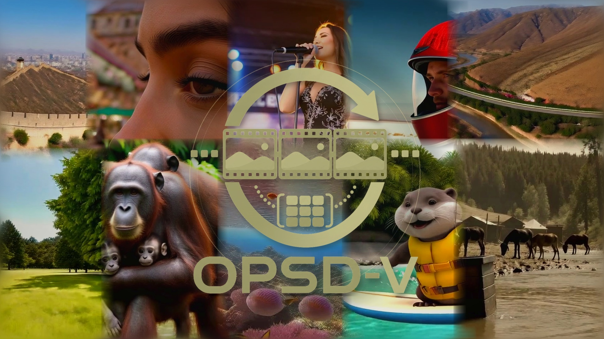

# OPSD-V

<p align="center">
  
</p>

<p align="center">
  <b>On-Policy Self-Distillation for Post-Training Few-Step Autoregressive Video Generators</b>
</p>

<p align="center">
  <a href="https://kumapowerliu.github.io/">Hongyu Liu</a><sup>1,2</sup> ·
  <a href="https://chunwang.site/">Chun Wang</a><sup>1,2</sup> ·
  <a href="https://scholar.google.com/citations?user=lFkCeoYAAAAJ&hl=en">Feng Gao</a><sup>1,*</sup> ·
  <a href="https://xuanhuahe.github.io/">Xuanhua He</a><sup>1,2</sup> ·
  <a href="https://mayuelala.github.io/">Yue Ma</a><sup>2</sup> ·
  <a href="http://raywzy.com/">Ziyu Wan</a><sup>3</sup> ·
  <a href="https://auto202603.github.io/">Yong Zhang</a><sup>1,†</sup> ·
  <a href="https://scholar.google.com/citations?user=JXV5yrZxj5MC&hl=zh-CN">Xiaoming Wei</a><sup>1</sup> ·
  <a href="https://cqf.io/">Qifeng Chen</a><sup>2,*</sup>
</p>

<p align="center">
  <sup>1</sup>Meituan &nbsp;&nbsp;
  <sup>2</sup>HKUST &nbsp;&nbsp;
  <sup>3</sup>City University of Hong Kong
  <br>
  <sup>*</sup>Corresponding authors &nbsp;&nbsp;
  <sup>†</sup>Project lead
</p>

<p align="center">
  <a href="#installation">Installation</a> |
  <a href="#checkpoints">Checkpoints</a> |
  <a href="#training">Training</a> |
  <a href="#inference">Inference</a> |
  <a href="#wechat-group">WeChat Group</a> |
  <a href="#citation">Citation</a>
</p>

<p align="center">
  <a href="assets/opsdv.pdf">
    
  </a>
  <a href="https://meigen-ai.github.io/OPSD-V/">
    
  </a>
  <a href="https://huggingface.co/MeiGen-AI/OPSD-V">
    
  </a>
  <a href="LICENSE">
    
  </a>
</p>

## WeChat Group

<p align="center">
  
</p>

<p align="center">
  Scan the QR code to join the OPSD-V discussion group. The code is valid until July 21, 2026.
</p>

OPSD-V is an on-policy self-distillation paradigm for post-training few-step autoregressive video diffusion models. It targets long-horizon error accumulation and weakened motion dynamics in distilled AR video generators while preserving the original few-step inference path. The student follows the exact deployment rollout, generating each chunk from its own evolving KV cache, while the teacher is evaluated at the same student-visited denoising states with a cleaner AR-consistent temporal cache built from real long-video context. This provides dense trajectory-level velocity supervision and improves long-horizon visual quality and motion dynamics without changing the sampler, number of denoising steps, or inference-time cache mechanism.

## Motivation

Few-step autoregressive video generators can synthesize long videos with low
latency, but their long rollout quality is still limited by the temporal states
they create for themselves. Each generated chunk is written back into the KV
cache and becomes context for all later chunks, so small artifacts, weak motion,
or semantic drift can accumulate over time. OPSD-V addresses this bottleneck by
using real long videos as privileged temporal context during post-training: the
student stays on the exact generated-cache trajectory it will visit at inference
time, while the teacher receives a cleaner AR-consistent cache for constructing
dense corrective targets.

<p align="center">
  
</p>

### Training-free GT-cache diagnostic

Before any post-training, the original generator already reveals the importance
of cache quality. Starting from the same real first chunk and prompt, we compare
standard rollout against a training-free intervention that refreshes older cache
history from the corresponding real video while keeping the most recent chunk
generated by the model. The improved rollout under this data-assisted cache
indicates that accumulated generated-cache degradation is a key bottleneck,
which motivates using real-video context to build a cleaner teacher during
OPSD-V training.

<p align="center">
  
</p>

## Highlights

- **On-policy student rollout.** The student writes its own generated chunks into the KV cache and keeps rolling out from the resulting temporal states.
- **Cleaner teacher context.** The teacher is evaluated on the same student-visited noisy latents and timesteps, but uses real-video history for older cache context.
- **Few-step path preserved.** OPSD-V does not change the original 4-step autoregressive sampler used at inference.
- **Memory-conscious training.** Chunk-wise backward, detached denoising transitions, FSDP, gradient checkpointing, and LoRA/EMA support keep long rollouts feasible.
- **Deterministic prompt seeding.** `--per_prompt_seed` avoids noise drift when resuming a partially generated evaluation folder.

## Method

OPSD-V continues post-training an existing few-step AR generator without
changing its sampler or inference-time cache mechanism. The student performs the
deployed rollout: it denoises each chunk with the fixed few-step scheduler,
writes the generated chunk into its KV cache, and continues from the resulting
self-induced state. The teacher is evaluated at the same temporal position,
denoising timestep, and student-visited noisy latent, but uses a cleaner
AR-consistent cache in which older history is replaced by real-video context
while the most recent generated chunk is preserved for autoregressive
continuation. We then match the student and teacher velocity predictions on
these on-policy states, providing dense denoising-level correction while keeping
the original few-step generation path intact.

<p align="center">
  
</p>

## Repository Layout

```text
configs/                 Training and inference YAML files
model/                   OPSD rollout, teacher cache, and loss logic
pipeline/                AR inference and OPSD streaming training pipelines
trainer/                 FSDP/LoRA trainer, EMA, resume, and checkpointing
utils/                   Dataset, scheduler, LoRA, memory, and Wan wrappers
wan/modules/             Wan2.1 modules and causal attention implementation
tools/                   Utility scripts
example/                 Prompt files for quick inference checks
train.py                 Distributed OPSD-V training entry point
inference.py             Text/LMDB inference entry point
```

This release excludes generated videos, logs, checkpoints, datasets, and unrelated legacy trainers.

## Installation

We recommend Python 3.10 with CUDA-capable GPUs. OPSD-V uses
`torch.nn.attention.flex_attention` in the causal Wan blocks, so PyTorch 2.5+
is the safest baseline. Install PyTorch for your CUDA runtime first, then
install the remaining packages from [`requirements.txt`](requirements.txt).

```bash
git clone <repository-url> opsd-v
cd opsd-v

conda create -n opsdv python=3.10 -y
conda activate opsdv
pip install -U pip
```

For example, on CUDA 12.1:

```bash
pip install torch==2.5.1 torchvision==0.20.1 \
  --index-url https://download.pytorch.org/whl/cu121

pip install -r requirements.txt
```

FlashAttention 2 or 3 is optional but strongly recommended for speed and
memory efficiency. Install the wheel that matches your PyTorch, CUDA, and GPU
architecture. For Ampere/Ada GPUs, FlashAttention 2 is usually enough; for
Hopper GPUs, FlashAttention 3 can be used when available. If FlashAttention is
not installed, the code falls back to PyTorch scaled-dot-product attention, but
long-video training/inference will be slower and may use more memory.

If you enable attention-mask debug visualizations in `utils/debug_option.py`,
install OpenCV as well:

```bash
pip install opencv-python
```

## Checkpoints

Download the official Wan2.1-T2V-1.3B backbone from Hugging Face and place it
under `checkpoints/Wan2.1-T2V-1.3B/`:

```bash
mkdir -p checkpoints
hf download Wan-AI/Wan2.1-T2V-1.3B \
  --local-dir checkpoints/Wan2.1-T2V-1.3B
```

The directory should contain the Wan transformer, VAE, T5 encoder, tokenizer,
and model config files, e.g.:

```text
checkpoints/Wan2.1-T2V-1.3B/
├── config.json
├── diffusion_pytorch_model*.safetensors or equivalent transformer weights
├── Wan2.1_VAE.pth
├── models_t5_umt5-xxl-enc-bf16.pth
└── google/umt5-xxl/
```

You can override this location either in YAML:

```yaml
model_kwargs:
  model_root: /path/to/Wan2.1-T2V-1.3B
```

or through an environment variable:

```bash
export WAN_MODEL_ROOT=/path/to/Wan2.1-T2V-1.3B
```

Download the OPSD-V released checkpoints into `checkpoints/`:

```bash
hf download MeiGen-AI/OPSD-V \
  checkpoints/longlive_base.pt \
  checkpoints/longlive_lora.pt \
  checkpoints/opsdv_longlive_lora.pt \
  checkpoints/self_forcing_dmd_ema_as_generator.pt \
  checkpoints/opsdv_self_forcing_lora.pt \
  --local-dir .
```

If your environment has not authenticated with Hugging Face yet, run
`hf auth login` first.

After downloading, the provided configs expect:

| File | Used by | Meaning |
| --- | --- | --- |
| `checkpoints/longlive_base.pt` | LongLive training/inference | Base few-step AR generator |
| `checkpoints/longlive_lora.pt` | LongLive training | Initial LongLive LoRA, if continuing from a released adapter |
| `checkpoints/self_forcing_dmd_ema_as_generator.pt` | Self-Forcing training/inference | Self-Forcing DMD/EMA generator |
| `checkpoints/opsdv_longlive_lora.pt` | LongLive inference | OPSD-V LoRA checkpoint |
| `checkpoints/opsdv_self_forcing_lora.pt` | Self-Forcing inference | OPSD-V LoRA checkpoint |

Base generator checkpoints may store weights under `generator`, `generator_ema`, or `model`. OPSD-V LoRA checkpoints store `generator_lora`, optional `generator_ema`, optimizer state, and `step`.

## Training Data

The full training dataset cannot be redistributed due to data licensing and
privacy constraints, and this repository does not include any video, latent,
embedding, or LMDB data files.

Training uses an LMDB containing precomputed text embeddings and Wan VAE latents.
See [`data_processing/`](data_processing/) for an audio-free preprocessing
pipeline that converts your own long videos into this LMDB format.
The loader accepts both naming schemes below:

```text
prompts_shape / text_shape
prompt_embeds_shape
latents_shape / video_shape

prompts_{i}_data / text_{i}_data       UTF-8 prompt string
prompt_embeds_{i}_data                 float16 text embedding bytes
latents_{i}_data / video_{i}_data      float16 latent bytes
```

For the released 480 x 832 setting, latent samples have shape:

```text
[T, 16, 60, 104]
```

The default configs sample from long latent windows with up to 243 frames and
train on a 180-frame OPSD rollout. They use a real-video first chunk, roll out
seven 3-frame chunks before applying loss (`opsd_loss_start_frame: 21`), and
supervise the later student-visited rollout states.

## Training

The paper experiments use 24 GPUs across 3 nodes, with 8 GPUs per node. On each node, set `MASTER_ADDR` to the address of rank-0 node and set `NODE_RANK` to `0`, `1`, or `2` respectively.

### LongLive continued post-training

```bash
export MASTER_ADDR=<rank-0-host>
export MASTER_PORT=29500
export NODE_RANK=<0|1|2>

torchrun --nnodes=3 --nproc_per_node=8 \
  --node_rank=${NODE_RANK} \
  --master_addr=${MASTER_ADDR} \
  --master_port=${MASTER_PORT} \
  train.py \
  --config_path configs/train_longlive_lora.yaml \
  --logdir logs/opsdv_longlive
```

### Self-Forcing continued post-training

```bash
export MASTER_ADDR=<rank-0-host>
export MASTER_PORT=29500
export NODE_RANK=<0|1|2>

torchrun --nnodes=3 --nproc_per_node=8 \
  --node_rank=${NODE_RANK} \
  --master_addr=${MASTER_ADDR} \
  --master_port=${MASTER_PORT} \
  train.py \
  --config_path configs/train_self_forcing_lora.yaml \
  --logdir logs/opsdv_self_forcing
```

Training resumes automatically from the latest `checkpoint_model_*/model.pt` in `--logdir`. Use `--no-auto-resume` for a fresh run or `--no_save` for a quick debugging run.

### Key OPSD-V options

| Option | Default | Purpose |
| --- | --- | --- |
| `opsd_student_context_mode` | `generated_kv` | Keep the student fully on-policy. |
| `opsd_teacher_context_mode` | `gt_kv` | Use real-video history for a cleaner teacher cache. |
| `opsd_teacher_trajectory_mode` | `student` | Evaluate teacher and student on student-visited noisy states. |
| `opsd_loss_type` | `flow` | Match velocity/flow predictions rather than reconstructed `x0`. |
| `opsd_loss_step_mode` | `all` | Supervise all denoising steps in the fixed few-step trajectory. |
| `opsd_loss_start_frame` | `21` | Skip the first seven 3-frame chunks before applying loss. |
| `opsd_backward_per_chunk` | `true` | Backpropagate chunk by chunk to reduce activation memory. |
| `opsd_use_relative_sink` | `true` | Match the relative-sink cache policy used at inference. |

## Inference

Generate from a text file with one prompt per line:

```bash
CUDA_VISIBLE_DEVICES=0 python inference.py \
  --config_path configs/inference_longlive.yaml \
  --data_path example/long_example.txt \
  --output_folder outputs/longlive \
  --num_output_frames 243 \
  --seed_list 1,2 \
  --use_lmdb_pipeline \
  --lmdb_cache_update_source generated \
  --lmdb_use_relative_sink \
  --per_prompt_seed
```

Use `configs/inference_self_forcing.yaml` for the Self-Forcing backbone:

```bash
CUDA_VISIBLE_DEVICES=0 python inference.py \
  --config_path configs/inference_self_forcing.yaml \
  --data_path example/MovieGenVideoBench_extended.txt \
  --output_folder outputs/self_forcing \
  --num_output_frames 243 \
  --seed_list 1,2 \
  --use_lmdb_pipeline \
  --lmdb_cache_update_source generated \
  --lmdb_use_relative_sink \
  --per_prompt_seed
```

`--per_prompt_seed` derives an independent deterministic noise seed from `(seed, prompt_index)`. This is useful for benchmarking because resuming a partially completed output folder will not shift the noise assigned to later prompts.

The text-prompt commands above run the cache-aware OPSD-V inference path, update the autoregressive cache with generated chunks, use relative-sink cache handling, and save videos at 16 FPS.

For LMDB inference with precomputed embeddings and optional real-video latents, add `--use_lmdb`:

```bash
CUDA_VISIBLE_DEVICES=0 python inference.py \
  --config_path configs/inference_longlive.yaml \
  --data_path data/eval.lmdb \
  --output_folder outputs/eval \
  --num_output_frames 243 \
  --use_lmdb \
  --lmdb_cache_update_source generated \
  --lmdb_use_relative_sink \
  --per_prompt_seed
```

Arguments that expose GT cache replacement or future GT context are diagnostic tools, not the standard open-ended generation setting.

### Reproduce the cache diagnostic

The diagnostic in the Motivation section can be reproduced with an LMDB that
contains prompts, text embeddings, and corresponding real-video latents. The
goal is not open-ended generation; it is to compare two cache policies under the
same original checkpoint and seed. The `generated` run is the standard rollout.
The `gt` run keeps the latest chunk model-generated but refreshes older cache
history from real-video latents, isolating the effect of cache degradation.

For LongLive, the original model uses its released LoRA adapter:

```bash
CUDA_VISIBLE_DEVICES=0 python inference.py \
  --config_path configs/inference_longlive_original.yaml \
  --data_path data/eval.lmdb \
  --output_folder outputs/longlive_generated_cache \
  --num_output_frames 243 \
  --use_lmdb \
  --lmdb_use_gt_first_chunk \
  --lmdb_cache_update_source generated \
  --lmdb_use_relative_sink \
  --per_prompt_seed

CUDA_VISIBLE_DEVICES=0 python inference.py \
  --config_path configs/inference_longlive_original.yaml \
  --data_path data/eval.lmdb \
  --output_folder outputs/longlive_gt_cache \
  --num_output_frames 243 \
  --use_lmdb \
  --lmdb_use_gt_first_chunk \
  --lmdb_cache_update_source gt \
  --lmdb_use_relative_sink \
  --per_prompt_seed
```

For Self-Forcing, the original checkpoint is loaded without any LoRA adapter:

```bash
CUDA_VISIBLE_DEVICES=0 python inference.py \
  --config_path configs/inference_self_forcing_original.yaml \
  --data_path data/eval.lmdb \
  --output_folder outputs/self_forcing_generated_cache \
  --num_output_frames 243 \
  --use_lmdb \
  --lmdb_use_gt_first_chunk \
  --lmdb_cache_update_source generated \
  --lmdb_use_relative_sink \
  --per_prompt_seed

CUDA_VISIBLE_DEVICES=0 python inference.py \
  --config_path configs/inference_self_forcing_original.yaml \
  --data_path data/eval.lmdb \
  --output_folder outputs/self_forcing_gt_cache \
  --num_output_frames 243 \
  --use_lmdb \
  --lmdb_use_gt_first_chunk \
  --lmdb_cache_update_source gt \
  --lmdb_use_relative_sink \
  --per_prompt_seed
```

## Future Work

OPSD-V explicitly uses real long-video data as privileged temporal context for
post-training. Our current experiments are intentionally modest in scale: about
3,800 one-minute videos, 24 H800 GPUs, and a short continued-training schedule.
Scaling the amount and diversity of real long-video data, increasing training
compute, or designing stronger teacher-cache policies may further improve
long-horizon stability and motion dynamics. We leave this data-and-compute
scaling direction as an important avenue for future exploration.

## Citation

```bibtex
@misc{liu2026opsdv,
  title  = {OPSD-V: On-Policy Self-Distillation for Post-Training Few-Step Autoregressive Video Generators},
  author = {Liu, Hongyu and Wang, Chun and Gao, Feng and He, Xuanhua and Ma, Yue and Wan, Ziyu and Zhang, Yong and Wei, Xiaoming and Chen, Qifeng},
  year   = {2026},
  note   = {Preprint}
}
```

## Acknowledgements

This codebase builds on [Wan2.1](https://github.com/Wan-Video/Wan2.1), [Self-Forcing](https://github.com/guandeh17/Self-Forcing), [LongLive](https://github.com/NVlabs/LongLive), and [D-OPSD](https://github.com/vvvvvjdy/D-OPSD). We thank their authors for releasing models and code. Please follow the licenses and usage terms of the corresponding base checkpoints and upstream components.

## License

OPSD-V code is released under the Apache License 2.0. See [LICENSE](LICENSE). This repository also contains files adapted from upstream projects, including Wan2.1 and Self-Forcing; those files retain their original copyright notices and license identifiers. Please follow the licenses and usage terms of the corresponding upstream code, models, and checkpoints.
